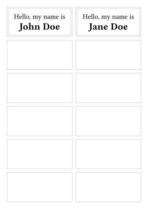

# Etikett

This template helps you print onto label sheets with rectangular grids of labels. It provides you with a grid of rectangular regions that you can draw label content into, potentially customizing the content of each individual label.

The main features are the following:
- configure the page dimensions to match the label sheet from your manufacturer: margins, number of labels per row and column, gutters between labels
  - "upside-down" support for cases when the paper should be put into the printer flipped 180°
- configure label layout: optional subdivision of labels into sub-labels, content orientation (equivalent to [`page.flipped`](https://typst.app/docs/reference/layout/page/#parameters-flipped))
  - "debug" mode in which label edges are shown
- apply content to (sub-)labels:
  - repeat label contents a specified number of times
  - apply a content-creating function to an array of data (taken e.g. from a JSON or CSV file)
  - skip labels that have already been used in a previous print

## Getting Started

Using the Typst web app, you can create a project by e.g. using this link: https://typst.app/?template=etikett&version=latest.

To work locally, use the following command:

```bash
typst init @preview/etikett
```

<picture>
  <source media="(prefers-color-scheme: dark)" srcset="./thumbnail-dark.svg">
  
</picture>

## Usage

See the [manual](docs/manual.pdf) for details.
